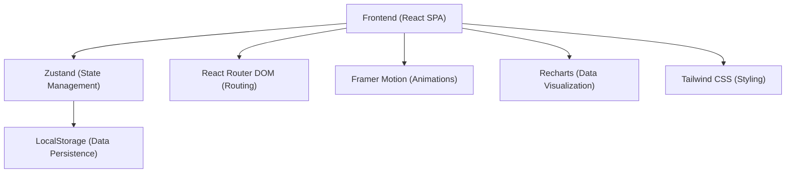
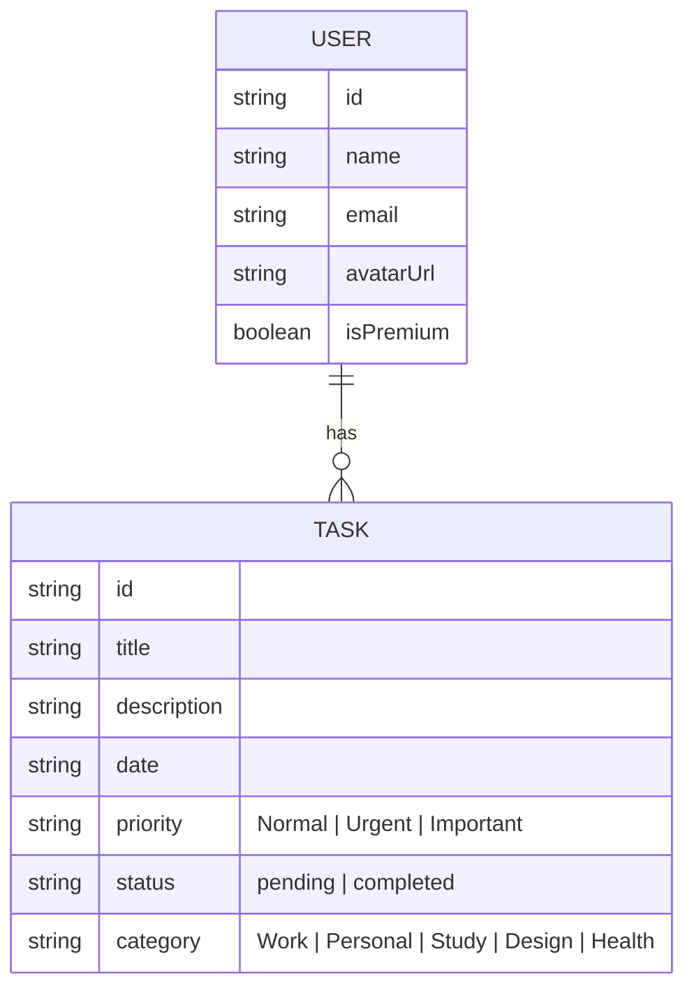

## 1. Architecture Design


## 2. Technology Description
- **Frontend**: React@18 + tailwindcss@3 + vite
- **State Management**: Zustand
- **Animations**: Framer Motion
- **Icons**: Lucide React
- **Charting**: Recharts
- **Routing**: React Router DOM v6
- **Data Persistence**: LocalStorage
- **Initialization Tool**: vite-init

## 3. Route Definitions
| Route | Purpose |
|-------|---------|
| `/` | Splash / Loading Screen |
| `/onboarding` | Onboarding Carousel |
| `/login` | User Login Page |
| `/signup` | User Signup Page |
| `/dashboard` | Main Dashboard / Home Page |
| `/calendar` | Calendar Schedule Page |
| `/add-task` | Add Task Page / Modal Route (can be modal over `/dashboard`) |
| `/task/:id` | Task Details Page |
| `/analytics` | Analytics / Productivity Page |
| `/profile` | Profile Page |
| `/settings` | Settings Page |

## 4. API Definitions
(N/A - Data is stored in LocalStorage for this frontend-focused app)

## 5. Server Architecture Diagram
(N/A)

## 6. Data Model
### 6.1 Data Model Definition


### 6.2 Data Definition Language
(N/A - JSON schema for LocalStorage below)
```typescript
interface User {
  id: string;
  name: string;
  email: string;
  avatarUrl: string;
  isPremium: boolean;
}

interface Task {
  id: string;
  title: string;
  description: string;
  date: string; // ISO format YYYY-MM-DD
  priority: 'Normal' | 'Urgent' | 'Important';
  status: 'pending' | 'completed';
  category: 'Work' | 'Personal' | 'Study' | 'Design' | 'Health';
}
```
