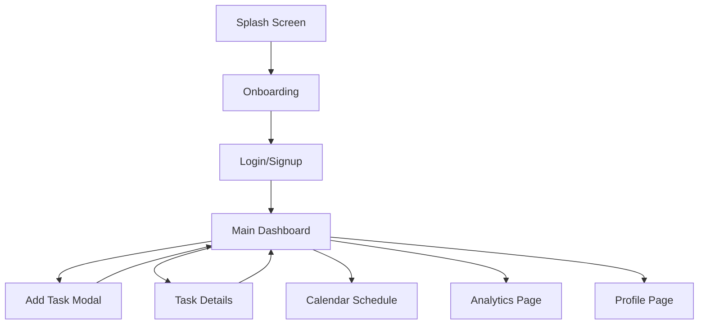

## 1. Product Overview
TaskFlow is a premium, modern, beautiful To-Do List and Task Management web app designed with a high-end, Dribbble-quality productivity dashboard aesthetic.
- The main purpose is to provide a visually striking, mobile-first task management experience where users can create tasks, assign priorities, select dates, track completed versus pending tasks, view daily/weekly progress, and manage their schedules visually.
- Target users are professionals and individuals seeking a polished, startup-level productivity SaaS tool that moves away from basic checklist designs to an elegant, soft, modern UI style.

## 2. Core Features

### 2.1 User Roles
| Role | Registration Method | Core Permissions |
|------|---------------------|------------------|
| Normal User | Email/Password or Social Login | Access to all task management, calendar, analytics, and profile features |

### 2.2 Feature Module
1. **Onboarding & Authentication**: Splash screen, onboarding carousel, login, and signup pages.
2. **Main Dashboard**: Hero page with user greeting, date picker, weekly/monthly calendar schedule (circular date buttons), and task list with smooth rounded cards.
3. **Calendar Schedule**: Detailed view of tasks organized by dates and priorities.
4. **Task Management**: Add Task Modal, Task Details, Edit/Delete, status toggling, categorization, and prioritization.
5. **Analytics & Productivity**: Dashboard showing completed/pending counts, daily completion bar charts, and category breakdown.
6. **Profile & Settings**: User details, premium upgrade prompt, overview stat cards, and app settings.

### 2.3 Page Details
| Page Name | Module Name | Feature description |
|-----------|-------------|---------------------|
| Splash Screen | Initial Load | Polished loading state with logo and smooth fade transition |
| Onboarding | Welcome | Carousel highlighting app features, "Get Started" button |
| Auth Pages | Login/Signup | Soft gradient backgrounds, clean input fields, authentication forms |
| Main Dashboard | Home | User avatar, greeting, date selector, highlighted calendar week, list of tasks grouped by priority, floating Add button, Bottom Navigation |
| Calendar Page | Schedule | Full calendar grid, task indicators per day |
| Add Task | Modal | Inputs for title, description, date, priority (Normal/Urgent/Important), category (Work/Personal/Study/Design/Health) |
| Task Details | View/Edit | Full task information, mark complete, edit, delete actions |
| Analytics | Stats | Recharts bar charts for daily completion, weekly productivity, category breakdown, animated stat cards |
| Profile | User Info | Large avatar, Premium upgrade card, completed/pending task counts |
| Settings | Preferences | App configuration options, logout |

## 3. Core Process
The main user flow involves onboarding, logging in, viewing the dashboard, adding tasks, and tracking progress.

## 4. User Interface Design
### 4.1 Design Style
- **Primary Colors**: Sky blue / cyan
- **Secondary Colors**: Soft violet
- **Accent Colors**: Coral / orange
- **Background**: White + pastel gradients (soft pastel blue gradient)
- **Button & Card Style**: White rounded cards (18px–28px border radius) with soft shadows, floating circular date buttons, floating gradient action button.
- **Font**: Clean, modern, iOS-inspired typography.
- **Layout Style**: Modern mobile-first composition, airy spacing, elegant bottom navigation.
- **Animations**: Soft animations on hover, tap, page transitions, and list reveals (Framer Motion).

### 4.2 Page Design Overview
| Page Name | Module Name | UI Elements |
|-----------|-------------|-------------|
| Main Dashboard | Hero & Task List | Soft gradient header, circular date picker, white rounded task cards with priority flags, smooth shadows |
| Profile Page | User Stats | Large avatar, bright pastel stat cards (coral/orange for pending, purple for completed), rounded bar chart container |
| Analytics Page | Productivity | Animated stat cards, Recharts soft pastel graphs, clean layout |

### 4.3 Responsiveness
Desktop-first with heavy mobile-adaptive focus (mobile-first UI style adapted for larger screens), touch optimization for date pills and task cards. Bottom navigation on mobile, side navigation on desktop.
